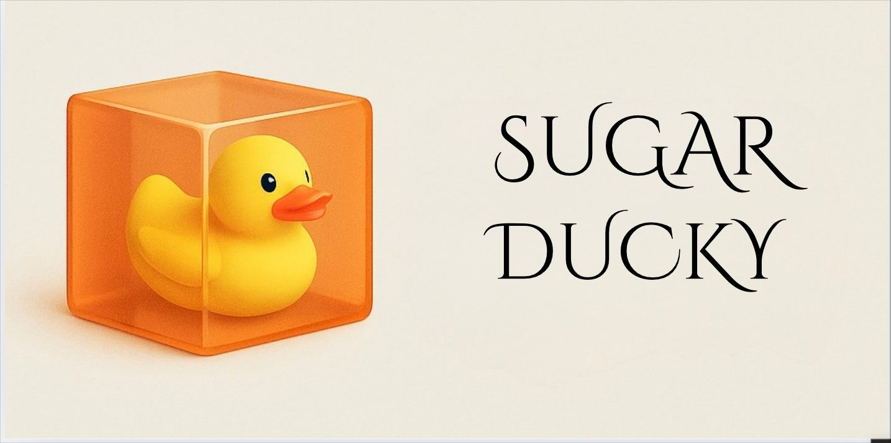

#🐤 SugarDucky

A performance evaluation system that assigns **rubber ducky points** based on daily task reviews. Combines natural language processing with a fun, gamified reward system to boost motivation and engagement in the workplace.



**Key Features** • [How To Use](#how-to-use) • [Download](#how-to-use) • [Credits](#technologies-used) 

---

## 🚀 Key Features

- 🔍 **Performance Analysis on Daily Reviews**
- 🎯 **Weighted Scoring System** based on verbs, adjectives, and task context
- 📈 **Efficiency & Performance Metrics** per employee
- 🐤 **Rubber Ducky Reward System** with up to 10 duckys per day!
- 📊 Ready for integration with dashboards or internal tools

---


## How to use?

You can download the latest version of **YourAppName** for Windows, Linux, and macOS from the [releases section](https://github.com/yourusername/your-repo-name/releases/latest).

---

## Development

To run the project locally:

```bash
$ git clone https://github.com/yourusername/your-repo-name.git
$ cd your-repo-name
$ npm install
$ npm start
```

To build the app for distribution:

```bash
$ npm run dist
```

---

## Technologies Used

- Electron
- HTML/CSS
- JavaScript
- Node.js

---
